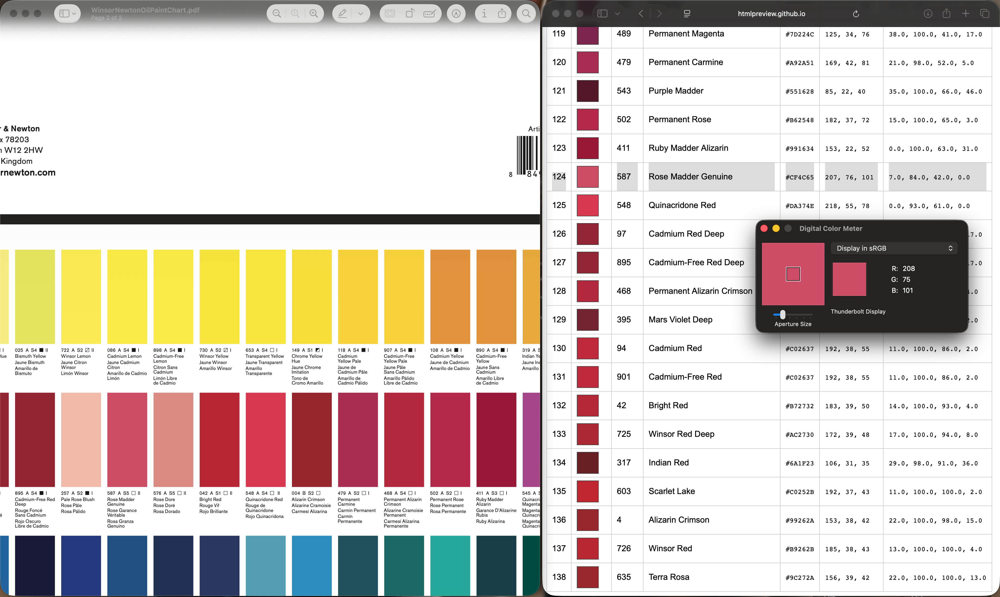

## quick and dirty two step process to generate RGB from a supplied PDF

Super dirty two step quick hack to extract CMYK from Winsor and Newton reference PDF which contains polygon fills of their paints. They no longer supply physical paint dot cards, so here we are.  Do not use in nuclear facilities or aircraft control systems, this is about as quick and dirty as it gets.  

Here's the PDF alonside the extracted data, and the macOS "color picker" with a small aperture.  It's pretty close, rounding errors exist, this was more to test if it was even possible.  You can see the comparison with Rose Madder Genuine, they all wobble around.  For example when we use colorimeters to do this we have to take three samples and average.  Fortunately our use case is in painting, and even mixing these colors requires amazing technical skill which is way beyond the scope of this dodgy python script.

It was created with two oneshot LLM prompts:

_“This PDF contains CMYK polygon fills of paint swatches, can you extract the CMYK values and the paint swatch names "e.g. Cadmium Yellow" so we can ground truth further analysis from the values inside the PDF, create a table of output.”_



[Here's what it all looks like as HTML by the end of it](https://htmlpreview.github.io/?https://raw.githubusercontent.com/DrCuff/WinsorExtractor/refs/heads/main/image_check.html)

[And here's the final TSV file](https://github.com/DrCuff/WinsorExtractor/blob/main/paint_colors_by_hue.tsv)

Finally, 

[This is the PDF from where we started with](https://github.com/DrCuff/WinsorExtractor/blob/main/WinsorNewtonOilPaintChart.pdf)


## If you want to run this

To start with this uses the system .icc files which can be found here on macOS, there are lots of icc files, conversions and such, this is a bit of a weird science.  I picked "standard" sRGB to convert from CMYK.  We have no clue how the original PDF was created only that it contains polygon fills with CMYK values we can extract with the pdfplumber module in python.

```
cp /System/Library/ColorSync/Profiles/Generic\ CMYK\ Profile.icc ./CMYK.icc
cp /System/Library/ColorSync/Profiles/sRGB\ Profile.icc ./sRGB.icc
```

**Step 1** 

Make the initial CMYK extraction csv (colorscript.py), the module extracted the names into the hash and hardcoded them, there's no real reason to do this, but it was what we had until we ran out of credits, it will do for now:

```
jcuff@midnight ~ % ~/.local/pipx/venvs/pdfplumber/bin/python ./colorscript.py
codes placed 138
rect row tops [23.4, 155.8, 288.3, 420.8, 553.2]
colors placed 138
missing color for code cells: set()
total rows written 138
{'Code': '004', 'Name': 'Alizarin Crimson', 'C': 22.0, 'M': 100.0, 'Y': 98.0, 'K': 15.0}
{'Code': '025', 'Name': 'Bismuth Yellow', 'C': 11.0, 'M': 0.0, 'Y': 84.0, 'K': 0.0}
{'Code': '034', 'Name': 'Blue Black', 'C': 77.0, 'M': 67.0, 'Y': 65.0, 'K': 84.0}
{'Code': '042', 'Name': 'Bright Red', 'C': 14.0, 'M': 100.0, 'Y': 93.0, 'K': 4.0}
{'Code': '045', 'Name': 'Royal Blue', 'C': 51.0, 'M': 38.0, 'Y': 0.0, 'K': 0.0}
{'Code': '056', 'Name': 'Brown Madder', 'C': 27.0, 'M': 88.0, 'Y': 97.0, 'K': 24.0}
{'Code': '058', 'Name': 'Bronze', 'C': 42.0, 'M': 61.0, 'Y': 92.0, 'K': 38.0}
{'Code': '059', 'Name': 'Brown Ochre', 'C': 22.0, 'M': 63.0, 'Y': 100.0, 'K': 8.0}
```

**Step 2** 

Create the RGB color map (convert_to_csv.py), this could have been incorporated into the colorscript.py, but the model refused to integrate them, and tried to make me design some PhD computer science program, where all I wanted was a quick conversion tool to read and write a csv file.  Because life is short, this is what we have:

```
jcuff@midnight ~ % python3 ./convert_to_csv.py  ./paint_cmyk_values.csv paint_rgb_values.csv ./sRGB.icc 
Wrote paint_rgb_values.csv

jcuff@midnight ~ % cat paint_rgb_values.csv 
Code,Name,C,M,Y,K,R,G,B,Hex
004,Alizarin Crimson,22.0,100.0,98.0,15.0,153,38,42,#99262A
025,Bismuth Yellow,11.0,0.0,84.0,0.0,229,229,83,#E5E553
```
